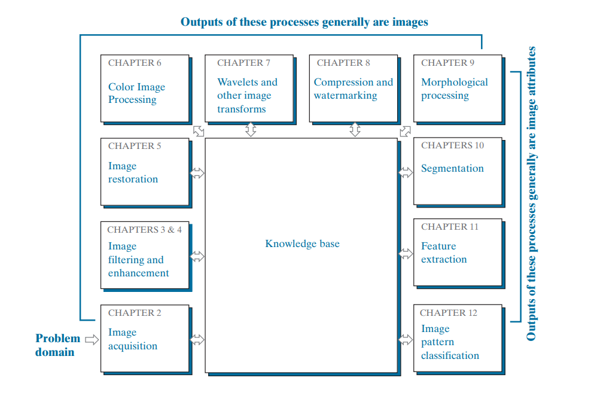
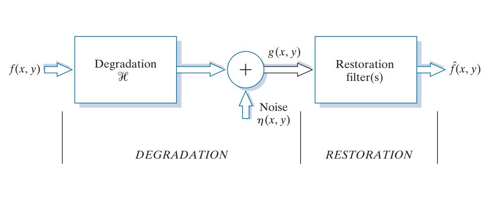
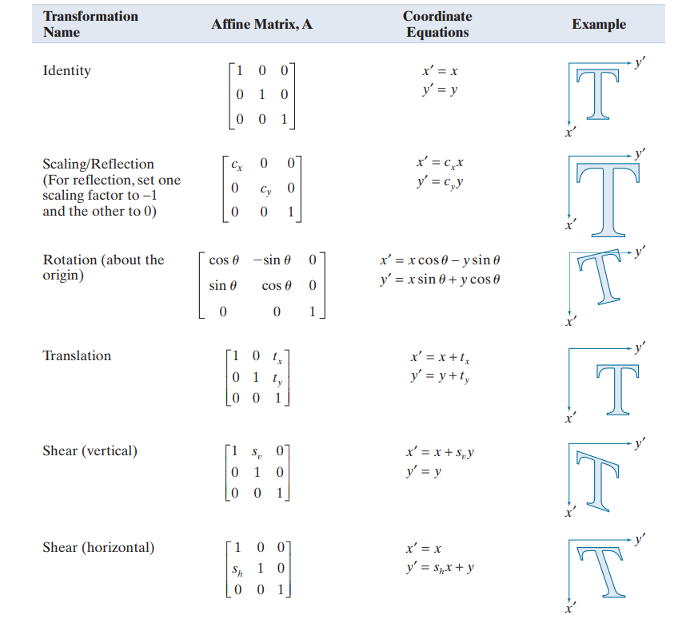

## Digital Image Processing
Digital image processing is the use of computer algorithms to perform operations on digital images. These operations can include things like image enhancement, restoration, and analysis.

- Digital Image Processing means processing digital image by means of a digital computer.

- Image Processing is a subset of Computer Vision.

## Digital Image Basics:
`Pixels`: The smallest unit of an image.\
`Resolution`: The number of pixels in an image.\
`Color Models`: RGB, grayscale, CMYK, etc.

## Fundamental steps in Digital Image Processing:

## Image Acquisition:

`Image Sensors:` CCD and CMOS. \
Sampling and Quantization.

## Image Enhancement
`Histogram Processing:`

- Histogram equalization.
- Contrast stretching.

`Spatial Domain Methods:`

- `Point operations:` Image negation, intensity transformation.
- `Neighborhood operations:` Image smoothing, sharpening.

`Frequency Domain Methods:`

- Fourier Transform.
- Filtering in frequency domain.

#### A model of the image degradation/restoration process.

## Image Restoration
`Noise in Images:`

- `Types of noise:` Gaussian, salt-and-pepper, etc.
- Noise reduction techniques: Spatial and frequency domain filtering.

`Image Deblurring:`

- Convolution and deconvolution.
- Wiener filtering.

## Image Compression
`Lossless Compression:`

- Run-Length Encoding (RLE).
- Huffman Coding.

`Lossy Compression:`

- Transform coding: Discrete Cosine Transform (DCT).
- JPEG compression.

## Image Segmentation
`Thresholding:`

- Global and local thresholding.
- Otsu's method.

`Edge Detection:`

- Gradient-based methods: Sobel, Prewitt.
- Laplacian of Gaussian (LoG).

#### Image segmetation algorithms
1. Region Growing
2. K-Means Clustering
3. Watershed Algorithm
4. Graph Cuts
5. SLIC (Simple Linear Iterative Clustering)

Image segmentation is the most difficult part of digital image processing. The more accurate the segmentation, the more likely the recognition is to be succeed

## Object Recognition
`Pattern Recognition:`

- Template matching.
- Feature extraction.

`Classification:`

Decision boundaries.
Machine learning in image processing.

## Morphological Image Processing
`Binary Image Operations:`

- Dilation, erosion, opening, and closing.

`Grayscale Image Operations:`

- Top-hat and bottom-hat transformations.

## Color Image Processing
Color image processing is divided into two major areas: 
- pseudo- and full-color processing.

`Color Models and Transformations:`

- RGB to HSV.
- Color correction.

`Color Image Enhancement and Segmentation.`

## Image Analysis and Computer Vision
`Feature Extraction:`

- Blob analysis.
- Corner detection.

`Object Tracking and Motion Analysis.`

## Affine Transformations
- It include scaling, translation, rotation, and shearing.

